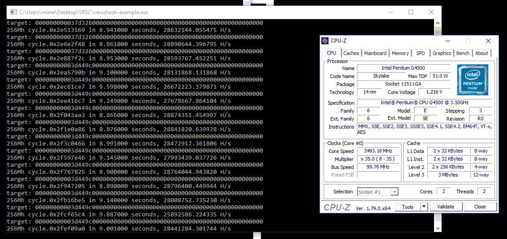

### Linux

```
git clone https://github.com/DeckerSU/verushash-example # for HTTPS connection
git clone git@github.com:DeckerSU/verushash-example.git # for SSH connection
cd verushash-example
./deps_build.sh # for build dependencies (curl and jansson)
make -f verushash_example.cbp.mak 
./bin/Release/verushash_example # for run
```

Mining will start with one thread, to launch multiple threads start `./bin/Release/verushash_example` once more. For example, for launching 4 threads - you should launch it 4 times, like:

```
./bin/Release/verushash_example &
./bin/Release/verushash_example &
./bin/Release/verushash_example &
./bin/Release/verushash_example &
```

To kill all instances use: `kill -9 $(pidof verushash_example)` .

### Windows

You'll need Microsoft Visual Studio **2015** for build this project. Use `deps_build.cmd` for automatically download and install dependencies, then open `verushash-example.sln` in MSVC and build project (choose Release / x64 configuration).

### Mining speed

 

**28 MH/s** even on 1 core (thread) of Intel Pentium G4500. You'll need a CPU with **AES** instructions set support. AVX/AVX2 don't needed.

### Donate

VRSC address: `RFfBcWw2JxPBnRHN9N82UsD1ArVryZQUxo`

